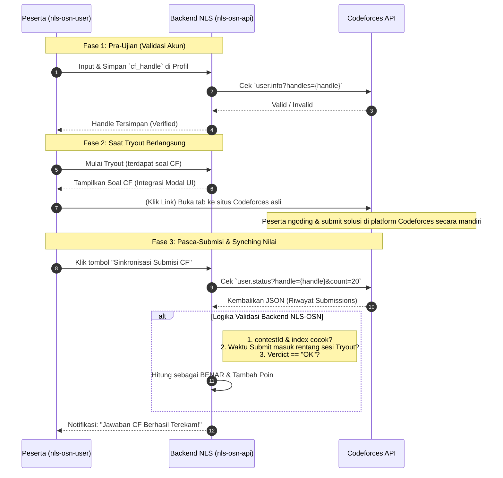

# Arsitektur Integrasi Codeforces: Konsep Submisi Peserta

Dokumen ini menjelaskan rancangan sistem bagaimana interaksi peserta dalam mengerjakan soal-soal Codeforces (Informatika) berlangsung mulai dari penautan akun hingga proses penilaian otomatis ter-sinkronisasi.

## Gambaran Alur (Workflow)

## Penjabaran Teknis tiap Fase

### 1. Account Linking (Penautan Akun)
Platform kompetitif **tidak memungkinkan** kita untuk langsung *submit* kode pesera ke Codeforces tanpa proxy (kecuali kita memiliki infrastruktur *bot account* tersendiri). 
Untuk platform ini, kita menggunakan sistem **Account Linking**.
- Admin / Backend menyediakan *field* `cf_handle` pada tabel `users`.
- Peserta wajib mengisi handle-nya.
- Sistem memvalidasi apakah handle tersebut bukan arsip kosong (tugas *endpoint* `/api/codeforces/user/{handle}`).

> [!IMPORTANT]
> Tanpa *handle* yang ditautkan, peserta hanya bisa melihat soal tetapi skor tidak akan masuk ke dalam kalkulasi *Tryout* karena sistem tidak tahu mencari submission milik siapa di server Codeforces.

### 2. Pelaksanaan di Muka Layar (User Interface)
Ketika sedang mengikuti ujian di NLS-OSN:
- Peserta membaca persoalan dengan _UI/UX_ yang persis sama rapinya seperti UI admin yang baru saja diimplementasikan sebelumnya (sudah ter-render persamaan matematikanya).
- Di bawah soal, disediakan tombol **Kerjakan di Codeforces**. Begitu tombol tersebut ditekan, maka peserta akan dialihkan langsung ke alamat asli masalah tersebut. Contoh: `https://codeforces.com/contest/1213/problem/B`
- Peserta dapat melakukan *login* dengan akun aslinya di Codeforces, memilih bahasa pemrograman (C++, Python, dsb) dari situs Codeforces, dan mengklik tautan penyelesaiannya ("Submit").

### 3. Penilaian Otomatis Berbasis Sinkronisasi
Sistem bekerja tanpa memerlukan infrastruktur bot (lebih murah bagi NLS-OSN secara _server usage_):
- Begitu hasil di situs Codeforces mengeluarkan putusan **"Accepted" (OK)**, sistem NLS-OSN tidak mendeteksinya secara seketika (*real-time*).
- Peserta yang merasa sudah di-ACC wajib menekan tombol **"Sync Submisi Codeforces"** pada panel NLS-OSN (atau jika sistem NLS-OSN menggunakan _background job/cronjob_, ia bisa menyinkron otomatis).
- Backend Anda (lewat Endpoint `CodeforcesController@userStatus` akan membaca semua putusan.
- Validasi sistem di NLS-OSN memastikan 2 hal super penting agar tidak ditipu: 
  1. **Keselarasan ID Soal:** Verdict yang OK tersebut harus benar-benar di soal yang sedang diujikan waktu itu.
  2. **Audit Waktu Submit:** `creationTimeSeconds` untuk solusi itu **mutlak wajib** berada di tengah-tengah rentang *Waktu Mulai Tryout hingga Selesai*. (Ini menghindari peserta me-*submit* ulang *(resubmit)* kode usang atau curang karena mereka sudah pernah mengerjakan problem Codeforces tersebut di masa lalu).

> [!TIP]
> Menggunakan metode ini jauh lebih bersih ketimbang Virtual Judge konvensional karena membebaskan server NLS-OSN dari tugas kompilasi kode yang berat (seperti memproses batasan memori/TLE), mendelegasikan tugas komputasi seluruhnya ke server Codeforces.

---
### Checklist Pengembangan Lanjutan *Frontend Peserta* (`nls-osn-user`)
Jika ingin segera melanjutkan implementasi sistem ini ke aplikasi peserta, diperlukan pembuatan:
- [ ] Opsi pengisian **Handle Codeforces Codeforces** pada menu *Edit Profile*.
- [ ] *Endpoint* API untuk menyimpan pembaruan nilai spesifik soal Codeforces (Trigger Sync).
- [ ] Layar pengerjaan Tryout *custom* yang menaruh soal tipe Codeforces dan tombol sinkronikasi terverifikasinya bersebelahan dengan deretan soal biasa (PG/Essay Bank).
